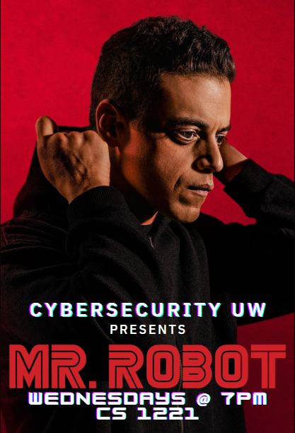

Hello Cybersecurity UW!

Join us TONIGHT (2/1) in CS 1221 to watch Mr. Robot episode 1 "eps1.0_hellofriend.mov" at 7pm. This is the first meeting for a semester long watch party where we will be watching Mr. Robot episode by episode and discussing the hacking methods used in the show. 

EVERYONE IS WELCOME TO ATTEND 🙂 

Can't come tonight but wanna join for future episodes? send us a message through email or discord, we'll find a way to catch you up! We will be having the group watch event every Wednesday at the same time, same room.

- trigger warnings for today's episode include: child pornography mentioned, violence, swearing, potential nudity
- if you need more in-depth knowledge of the heavy topics this show covers, send us a message.

Best,
Cybersecurity UW Leadership Team